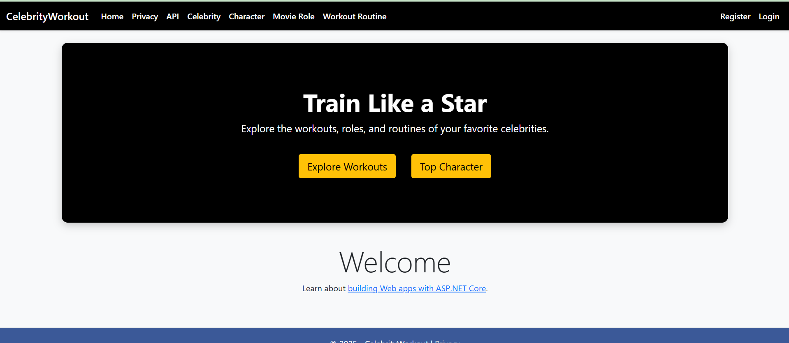

# 🎬 CelebrityWorkout

**CelebrityWorkout** is a full-featured ASP.NET Core MVC web application that connects the worlds of fitness and film. Users can explore detailed profiles of celebrities, the roles they've played in movies, and the specific workout routines they used to prepare for those roles.

---

## 🚀 Features

- ✅ Full CRUD for:
  - Celebrities
  - Movie Roles
  - Movie Characters
  - Workout Routines
- 🖼️ **Image Uploading** for celebrity profiles
- 🔐 **Admin-only** access for Create, Edit, Delete operations
- 🎨 Custom themed layout with Bootstrap 5 and dark navbar
- 💪 **Special Movie Workouts** (e.g., “Batman Strength Routine” or “Rocky Boxing Drills”)
- 🔄 Entity relationships with dropdowns (e.g., assign workouts to celebrities)
- 📄 Swagger UI for API testing and exploration
- 🧼 Clean and modular structure using Services, Interfaces, DTOs, and ViewModels

---

## 📸 Screenshots

## 📸 Screenshots

### 🏠 Home Page with Hero Section

### 📄 Celebrity List with Uploaded Images

---

## 🛠️ Technologies Used

- ASP.NET Core MVC (.NET 6/7)
- Entity Framework Core (Code-First + Migrations)
- SQL Server / LocalDB
- ASP.NET Core Identity for login and admin authorization
- Bootstrap 5 for responsive design
- Swagger (Swashbuckle.AspNetCore)
- Razor Pages + ViewModels + DTOs

---

